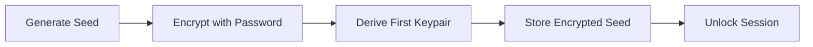
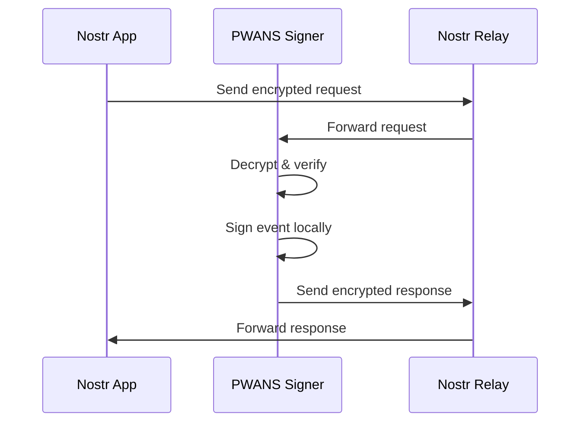

# 🔐 PWANS - Progressive Web App Nostr Signer

A secure, mobile-first Progressive Web App for managing Nostr identities and signing events. PWANS combines the convenience of a web app with the security of client-side encryption, giving you full control over your Nostr keys.

[](https://pwans.com)
[](LICENSE)

---

## ✨ Features

### 🔑 **Identity Management**
- **HD Wallet Support** - Generate multiple addresses from a single seed phrase (BIP-39)
- **Import Options** - Support for seed phrases, nsec keys, and encrypted backups
- **Multiple Profiles** - Manage multiple Nostr identities in one place
- **Profile Editing** - Update your Nostr profile (name, picture, bio, NIP-05, Lightning address)

### 🔐 **Security First**
- **Client-Side Encryption** - All encryption happens in your browser using Web Crypto API (AES-GCM)
- **No Server Access** - Your keys never leave your device
- **Password Protected** - Strong password encryption with PBKDF2 key derivation
- **Encrypted Backups** - Export encrypted wallet backups for safe storage
- **Auto-Lock** - Automatic session timeout for added security

### 🌐 **Remote Signing (NIP-46)**
- **Nostr Connect** - Act as a remote signer for other Nostr apps
- **Bunker URI** - Generate bunker:// URIs for easy connection
- **Auto-Approval Rules** - Set granular permissions for connected apps
- **Activity Log** - Monitor all signing requests and approvals
- **Rule Preservation** - Keep auto-approval settings when reconnecting

### ₿ **Bitcoin Wallet**
- **Nostr-Derived Addresses** - Bitcoin addresses derived from your Nostr private key (not from seed words)
- **Taproot Support** - Native SegWit v1 addresses (BIP-86)
- **Transaction History** - View and track all transactions
- **Send & Receive** - Simple interface for Bitcoin transfers
- **Contact Management** - Send to Nostr follows easily
- **Block Explorer Links** - Quick access to transaction details

### 📱 **Progressive Web App**
- **Install to Home Screen** - Works like a native app
- **Offline Capable** - Service worker for offline functionality
- **Mobile Optimized** - Responsive design for all screen sizes
- **Fast & Lightweight** - Optimized bundle size and performance

---

## 🚀 Quick Start

### **Option 1: Use the Live App**
Visit [https://pwans.com](https://pwans.com) and install to your home screen.

### **Option 2: Self-Host**
1. Download the latest release
2. Extract the files
3. Serve the `dist` folder with any static file server
4. Access via HTTPS (required for PWA features)

### **Option 3: Build from Source**
```bash
# Clone the repository
git clone https://github.com/your-username/pwans.git
cd amber-pwa

# Install dependencies
npm install

# Build for production
npm run build

# Serve the dist folder
npx serve dist
```

---

## 🔒 Security Model

### **How Your Keys Are Protected**

1. **Encryption at Rest**
   - Private keys are encrypted with AES-GCM before storage
   - Only encrypted data is saved to browser localStorage
   - Decrypted keys exist only in memory while unlocked

2. **Client-Side Only**
   - All cryptographic operations happen in your browser
   - No server-side code - just static HTML/CSS/JS files
   - GitHub Pages/servers only serve files, never execute code

3. **No Network Transmission**
   - Your nsec/private key **never** leaves your browser
   - Relays only see signed events (public key + signature)
   - NIP-46 uses encrypted messages - private key stays local

4. **Password Security**
   - PBKDF2 key derivation from your password
   - Random salt and IV for each encryption
   - Password never stored, only used for encryption/decryption

### **What Can Access Your Keys?**

| Entity | Access Level |
|--------|-------------|
| ❌ Server/GitHub Pages | No access - serves static files only |
| ❌ Other browsers/devices | No access - encrypted storage is local |
| ❌ Nostr relays | No access - only see public keys & signatures |
| ❌ Connected apps (NIP-46) | No access - you sign locally, they get results |
| ⚠️ Browser extensions | Potential risk - use trusted extensions only |
| ⚠️ Physical device access | Risk if weak password - use strong passwords |

### **Best Practices**
- ✅ Use a strong, unique password (12+ characters)
- ✅ Backup your seed phrase offline
- ✅ Only install trusted browser extensions
- ✅ Keep your browser updated
- ✅ Use device lock screen protection
- ✅ Don't use on shared/public computers

---

## 🛠️ Technical Stack

### **Frontend**
- **React 18** - UI framework
- **TypeScript** - Type safety
- **Vite** - Build tool and dev server
- **Zustand** - State management
- **Tailwind CSS** - Styling

### **Nostr Libraries**
- **@nostr-dev-kit/ndk** - Nostr Development Kit
- **nostr-tools** - Core Nostr utilities
- **NIP-46** - Remote signing protocol
- **NIP-04/NIP-44** - Encrypted direct messages

### **Cryptography**
- **Web Crypto API** - AES-GCM encryption
- **@scure/bip39** - Mnemonic generation
- **@scure/bip32** - HD key derivation
- **bitcoinjs-lib** - Bitcoin operations

### **PWA Features**
- **Vite PWA Plugin** - Service worker generation
- **Workbox** - Offline caching strategies
- **Web App Manifest** - Install to home screen

---

## 📖 How It Works

### **Wallet Creation Flow**


### **Remote Signing Flow (NIP-46)**


### **Security Architecture**
```
┌─────────────────────────────────────┐
│         Browser Memory              │
│  ┌──────────────────────────────┐  │
│  │  Decrypted Key (when unlocked)│  │
│  │  ⚠️ Cleared on lock/logout    │  │
│  └──────────────────────────────┘  │
└─────────────────────────────────────┘
              ↕️ (decrypt/encrypt)
┌─────────────────────────────────────┐
│       localStorage (Encrypted)      │
│  ┌──────────────────────────────┐  │
│  │  🔒 AES-GCM Encrypted Seed   │  │
│  │  🔒 Encrypted Keypairs        │  │
│  │  ✅ Public Keys (not secret)  │  │
│  └──────────────────────────────┘  │
└─────────────────────────────────────┘
```

---

## 🎯 Use Cases

### **For Nostr Users**
- Secure key management without browser extensions
- Mobile-friendly remote signing for Nostr apps
- Backup and restore your Nostr identity
- Manage multiple Nostr profiles

### **For Developers**
- Reference implementation of NIP-46
- Example of client-side encryption in PWAs
- HD wallet implementation for Nostr
- Bitcoin integration with Nostr

### **For Privacy Advocates**
- Fully client-side, no server trust required
- Open source and auditable
- Self-hostable
- No tracking or analytics

---

## 🤝 Contributing

Contributions are welcome! Please feel free to submit a Pull Request.

### **Development Setup**
```bash
# Install dependencies
npm install

# Start dev server
npm run dev

# Build for production
npm run build

# Preview production build
npm run preview
```

### **Project Structure**
```
src/
├── components/     # React components
├── services/       # Business logic (crypto, signing, etc.)
├── store/          # Zustand state management
├── types/          # TypeScript type definitions
└── utils/          # Utility functions
```

---

## 📄 License

MIT License - see [LICENSE](./LICENSE) file for details

---

## ⚠️ Disclaimer

This software is provided "as is", without warranty of any kind. Use at your own risk. Always backup your seed phrase and test with small amounts first.

**IMPORTANT**: This is a web-based wallet. For maximum security with large amounts, consider using a hardware wallet.

---

## 🙏 Acknowledgments

- [Nostr Protocol](https://github.com/nostr-protocol/nostr) - Decentralized social protocol
- [NDK](https://github.com/nostr-dev-kit/ndk) - Nostr Development Kit
- [nostr-tools](https://github.com/nbd-wtf/nostr-tools) - Nostr utilities
- [Bitcoin.js](https://github.com/bitcoinjs/bitcoinjs-lib) - Bitcoin library

---

<div align="center">

**Built with ❤️ for the Nostr community**

</div>
